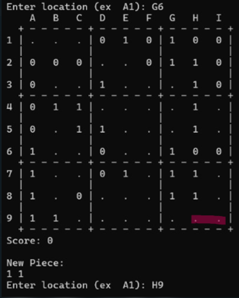
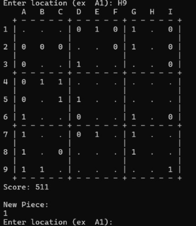

# Binary Sudoku (C Console Game)

A grid-based puzzle game implemented in C, merging traditional Sudoku structure with dynamic piece placement and binary score evaluation.
---

## 📊 Project Presentation & Documentation
* 📑 **[View Project Presentation (PDF)](docs/Project-Presentation.pdf)** *(Recommended — Overview of mechanics, piece layout & architecture)*
* 📝 **[View Progress Report (PDF)](docs/Project-Report.pdf)** *(Detailed algorithm explanations, flowcharts & team task logs)*

---

  
  
   
  <em>Figure: Piece placement (left) resulting in full column clearance and binary score computation (right).</em>

---

## 🎮 Game Overview & Rules
* **Grid Layout:** Played on a 9x9 matrix organized into nine 3x3 sub-grids.
* **Piece Mechanics:** 10 distinct geometric piece variations generate sequentially at random.
* **Line & Block Clears:** Placing pieces to complete any full row, column, or 3x3 square clears those cells.
* **Binary Scoring:** Cells cleared in rows, columns, or blocks are evaluated as binary numbers (0s and 1s) and converted into base-10 integer score increments.
* **Game Over:** Triggers when the board contains no valid coordinates remaining to place the active piece.

---

## 🛠️ Key Contributions & Algorithmic Implementation
* **Placement & Collision Detection:** Authored the core routines (`place_piece`, `valid_invalid`) that check boundaries, validate coordinate inputs, and prevent tile collisions.
* **Clear & Evaluation Logic:** Implemented detection algorithms within `check_clear` to identify completed rows, columns, and 3x3 blocks, executing matrix clearance and score calculation.
* **Input & Edge-Case Handling:** Resolved coordinate parsing issues and handled edge-case boundary conditions across the grid.

---

## 👥 Contributors
* Ömer Ege NİŞLİ
* İsmail ÖZTÜRK
* Mehmetcan KIRCA
* Muhammet Emre AY
* Zeynep SEYHUN
* Halil Ilgaz KESKİN
* Yiğithan YILDIRIM

*Course Instructor: Dr. Özlem ÖZTÜRK*
